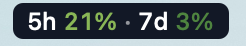
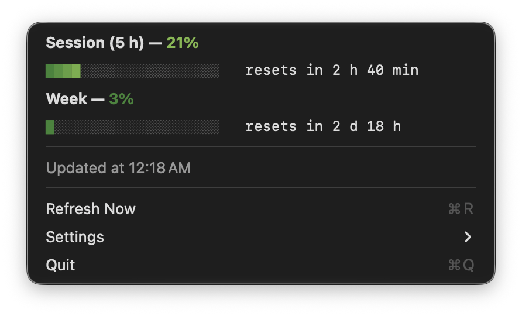

# ClaudeUsage

A tiny macOS menu bar app that shows your Claude subscription usage limits: the 5‑hour session and the weekly limit.



Click it to see every limit with a colored progress bar and the time until it resets.



> **Unofficial project.** It is not affiliated with, endorsed by, or supported by Anthropic.
> It relies on an **undocumented** endpoint that may change or disappear at any time.

## Features

- **Menu bar:** shows the 5‑hour and weekly limits. The menu also lists per‑model weekly limits (Opus, Sonnet).
- **Rounded background:** the item sits on a rounded pill, `#111827` by default, so every color on the scale stays readable in both light and dark menu bars. Label text switches between white and black to contrast with the background you choose.
- **Colors:** each percentage gets a color on a smooth scale. By default:

  | 0 % | 25 % | 50 % | 75 % | 100 % |
  |---|---|---|---|---|
  | `#2E7D32` | `#8BC34A` | `#FDD835` | `#FB8C00` | `#D32F2F` |

  Values in between are blended smoothly. Only the number and the `%` sign are colored. In the menu, each segment of the progress bar takes the color of its own position, so the bar fades from green toward red as it fills. You can pick your own color for each point, or switch to a single color.
- **Alert at 90 %:** a macOS notification fires once when a limit reaches 90 %, in the app's selected language. After that limit resets, it can fire again.
- **Open at login:** turned on automatically the first time the app runs.
- **Refresh:** every 5 minutes and after the Mac wakes from sleep. When rate‑limited, it waits longer between tries.
- **Languages:** English, Українська, Deutsch, Français, Español, Italiano, Polski. By default the app follows the system language.
- **Lightweight:** no Dock icon and no dependencies. The whole app is a single Swift file.

## Settings

Click the menu bar item and open **Settings**:

| Option | Default | |
|---|---|---|
| Language | system language | Interface and notification language |
| Colors → Color by Usage / Single Color | Color by Usage | Smooth color scale, or one color for everything |
| Colors → Color at 0%… 100%… | see table above | Opens the macOS color picker. Changes show up live |
| Colors → Single Color… | `#F3F4F6` | The color used in single‑color mode |
| Colors → Show Background | on | Turns the rounded background on or off |
| Colors → Background Color… | `#111827` | Background color |
| Colors → Reset Colors | | Restores all default colors |
| Notify at 90% | on | Turns the 90 % notification on or off |
| Open at Login | on | Starts the app when you log in |

With the background off, a light color can be hard to read on a light menu bar.

Settings are stored in `~/Library/Preferences/local.claudeusage.plist`.

## Requirements

- macOS 14 (Sonoma) or later.
- Xcode Command Line Tools (`xcode-select --install`).
- [Claude Code](https://docs.claude.com/en/docs/claude-code) installed and signed in **with a Claude subscription (Pro/Max)**. API‑key sign‑in does not work.

## Installation

```bash
git clone https://github.com/Marian-Kysil/ClaudeUsage.git
cd ClaudeUsage
./build.sh
cp -R ClaudeUsage.app /Applications/
open /Applications/ClaudeUsage.app
```

Launch it from `/Applications`. The login item points to the copy that ran first.

On first launch macOS asks for two permissions:

- **Keychain:** access to the `Claude Code-credentials` item. Click **Always Allow**. The app is signed only locally, so you may be asked again after each rebuild.
- **Notifications:** allow them if you want the 90 % alert.

macOS may also show a "Background item added" notice for the login item. That's expected.

## How it works and privacy

Every 5 minutes the app:

1. Reads the Claude Code OAuth access token from the Keychain (`Claude Code-credentials`), or from `~/.claude/.credentials.json` as a fallback.
2. Sends **one** `GET` request to `https://api.anthropic.com/api/oauth/usage` with that token.
3. Shows the result.

It **does not**:

- store, log, or send the token anywhere else;
- refresh the token (so it never interferes with Claude Code's own sign‑in);
- call any model, so it does not use up your limits.

Notifications are local and produced by macOS on your Mac. All the code is in [`main.swift`](main.swift), so you can check this yourself before building.

## Troubleshooting

| Message | What to do |
|---|---|
| Claude Code sign-in not found | Install Claude Code, run `claude`, then `/login` and pick the subscription option. |
| Keychain access denied | Quit and relaunch the app, then click **Always Allow**. |
| Token expired | Open Claude Code and run any command. It refreshes the token itself. |
| Couldn't parse the response | The undocumented API probably changed. Please open an issue. |
| No 90 % notification | Check **System Settings → Notifications → ClaudeUsage**, and **Settings → Notify at 90%** in the app. |

## How this was made

This app was written with the help of an AI coding assistant ([Claude Code](https://docs.claude.com/en/docs/claude-code)). I reviewed, built, and tested it on my own Mac.

## License

[MIT](LICENSE)
